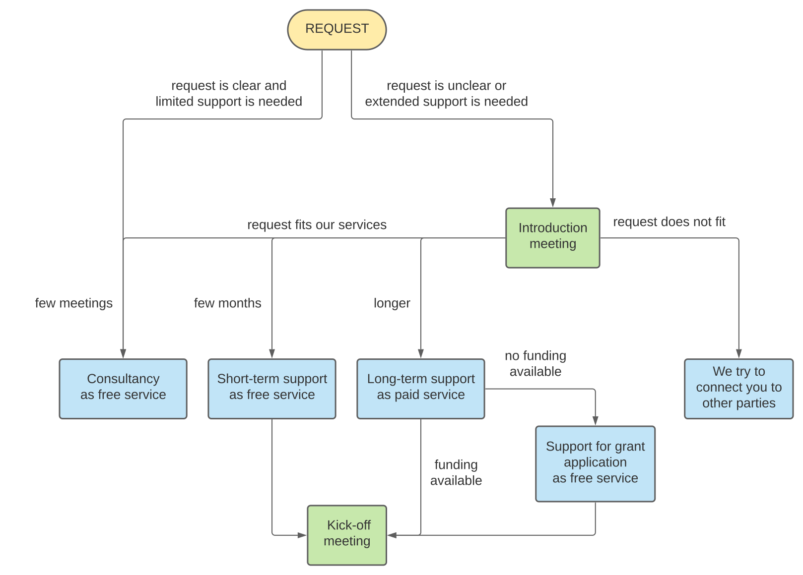

Our goal is to increase research impact through advanced digital technologies. To achieve this, we work together with UU researchers to develop innovative research software and help build digital skills in academia.

Learn more about us
 
<ul>
<li><a href="#our-mission">Our mission</a></li>
<li><a href="#who-we-are">Who we are</a></li>
<li><a href="#what-we-do">What we do</a></li>
<li><a href="#how-we-work">How we work</a></li>
</ul>

Get in touch
 
<ul>
<li><a href="https://fd21.formdesk.com/universiteitutrecht/re_request">Request our support</a></li>
<li><a href="https://github.com/orgs/UtrechtUniversity/teams/research-engineering">Find us on GitHub</a></li>
<li><a href="#contact">Contact us</a></li>
</ul>

 

  
  <figcaption>Administration Building &copy;UU Dick Boetekees</figcaption>

 

## About us

#### Our mission
Researchers of all domains increasingly require the use of digital technologies in their work. Our team caters to this need by collaborating with researchers in projects and consulting them on research IT matters. By doing so, we act as a knowledge hub where expertise gained in temporary projects are safeguarded and used for cross-pollination across domains. At the same time, we provide a collaborative community for researchers and IT staff at Utrecht University. 

*Our mission is to help researchers increase the impact of their work.*

#### Who we are
We are a diverse team of Research Engineers with combined experience in software engineering and academic research. Our engineers have backgrounds in i.a. computer science, data science, physics, Earth and environmental sciences. 

Our skills and expertise include:
  - high performance computing;
  - machine learning;
  - natural language processing;
  - computer modelling and simulations;
  - data analysis;
  - Python, R, MATLAB, FORTRAN, Docker, Shiny and much more.

Meet our team:


#### What we do
We support UU researchers of all domains in various stages of their research; from social sciences to natural sciences, from students to professors, from planning to execution.

Our core activities are:
- developing sustainable and robust research software;
- promoting software best practices in research;
- building a research software community at Utrecht University.

We can help you with, for example:
- defining technical implementation of your research plan or grant proposal;
- assessing technical feasability of your research method;
- finding the appropiate digital technology for your research;
- developing [FAIR](https://fair-software.nl/) research software to answer your research question;
- setting up a data processing pipeline;
- selecting and using [High Performance and Cloud computing](_pages/hpc/index.md) facilities;
- connecting to potential knowledge partners.

#### How we work
We provide consultancy and engineering in research projects in various formats:
- **Consultancy** in your project is always possible. Typically, consultancy consists of one or two meetings where we discuss your project and offer technical advice free of charge.
- We also offer **short-term engineering** support as a free service. During a period of a few months, you will have regular meetings with one or two Research Engineers, with the aim of developing a proof-of-concept or exploring a new method for your research.
- [**Long-term support**](_pages/long-term-support/index.md) is possible and can be tailored to your project, provided that funding is available for our services. We can also help you write the technical aspect of your grant proposal, in which our support is included.

We do not merely produce software on behalf of researchers; we work collaboratively and iteratively, since we depend on the researcher's domain expertise to steer the project. Furthermore, a close collaboration enables researchers to build digital skills and thereby empowering them in their work. We therefore expect researchers to be committed to regular meetings for the duration of the project.

Due to our limited capacity, support in your project cannot be guaranteed. Our aim is to help researchers throughout Utrecht University and to keep innovating as a team, so we select our projects accordingly. We give priority to projects that align with the Utrecht University [mission and vision](https://www.uu.nl/en/organisation/profile/mission-and-strategy) to work towards a better world through [Open Science](https://www.uu.nl/en/research/open-science).

This flowchart shows how we handle a request for support: 
 

  

 

#### Contact
- Talk to us directly during the [Walk-in hours on research data and software](https://www.uu.nl/en/research/research-data-management/walk-in-hours-workshops/walk-in-hours-research-data-software) in the UU Library.
- Contact us digitally via research.engineering@uu.nl, or fill in [this form](https://fd21.formdesk.com/universiteitutrecht/re_request) to request our support directly.
- Typically we can be found in room 3.40 of the [Administration Builing](https://www.uu.nl/en/bestuursgebouw), Heidelberglaan 8 at Utrecht Science Park on Mondays and Thursdays.
- The Research Engineering team is part of [Research Data Management Support](https://www.uu.nl/en/research/research-data-management) and [Information Technology Services](https://www.uu.nl/en/organisation/information-and-technology-services-its) at Utrecht University. 
